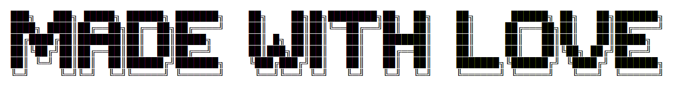

<h1> hi there, i'm lara</h1>

I'm an Electrical Engineering Student. I'm currently finishing my degree and whipping up a few projects on the side.

<!---->
<ul>
>>  I’m currently working on a <b>Discrete ADC</b> project.  
>>  I’m currently Learning how to use <b>Kernel</b>.   
>>  Most of my projects are available <a href="https://github.com/lara-musa?tab=repositories">here</a>.   
>>  Check out my <a href="">portfolio -- this is a work in progress</a>. 
</ul>

<h3>Languages I code with</h3>

  
  
  
  
  

<h3>Technologies I use</h3>

  
  
  
  
  
  
  
  

<h3> 🪴 Nature in Calgary</h3>

Here are some pictures taken by me

also a work in progress
<!-- plant emoji source: https://emojipedia.org/potted-plant -->

 
<!-- WEATHER_START -->
☁️Currently in Calgary:

The temperature is  **10°C, *Partly cloudy***

Sunrise: ***8:24 AM***,         Sunset: **6:15 PM**

Day length: **9 hours, 50 minutes**

> Last updated at 4:18 PM MDT
<!-- WEATHER_END -->
This updates automatically!
<!-- weather data source: https://weatherstack.com/dashboard -->
<!-- time data source: https://sunrise-sunset.org/api -->

<h3>Where to find me</h3>

 
   
  

